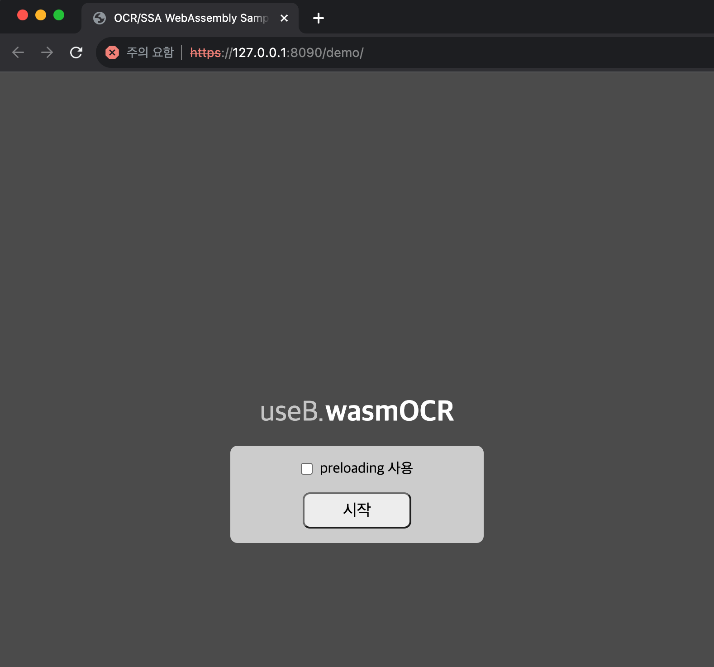

# 샘플 코드 셋업 가이드

- Step 0) 개발환경 구축 (Node.js, NPM, http-server) 설치

  - https://nodejs.org/ko/download/ 에서 LTS 최신버전 설치
  - 정상적으로 설치되었는지 확인

    

  - http-server 설치 :
    - Linux, MAC :
    ```shell
    sudo npm install -g http-server
    ```
    - Windows :
    ```batch
    npm install -g http-server
    ```
  - gulp-cli 설치 :
    gulp 명령어를 사용하기 위한 cli입니다.
    ```shell
    sudo npm install -g gulp-cli
    ```

---

- Step 1) 샘플 코드 다운로드
  - https://github.com/useb-inc/wasm-ocr-sample-web/archive/refs/heads/main.zip

---

- Step 2) 압축 풀기 및 데모(또는 샘플) 코드 디렉토리로 이동, 연관 node package 설치
  - 압축 풀기
    - 다운로드한 zip 파일을 압축 해제
  - 데모 코드 예시
    - 압축해제한 곳에서 `demo` 폴더에 `index.html` 파일을 참고
  - SDK 코드
    - 압축해제한 곳에서 `sdk` 폴더참고

---

- Step 3) 실행(https server 실행, 임의로 생성한 샘플 인증서 사용) 및 테스트

  - 인증서 생성

    - `openssl req -newkey rsa:2048 -new -nodes -x509 -days 3650 -keyout key.pem -out cert.pem` 명렁어로 실행 후 'cert.pem' 파일과 'key.pem' 파일이 생성된 것 확인
    - ※ 윈도우 cmd의 경우 'openssl' 명령이 실행되지 않음, `git bash`를 실행하여 git bash 상에서 명령어 수행)

  - web server 실행
    - `http-server -S -C cert.pem -p 8090 -c-1 ./` 명령어로 서버 실행

---

- Step 4) 접속 및 테스트(휴대폰 권장, PC의 경우 웹캠 화질이 충분히 좋아야 함)

  - Step 3)에서 나온 서버주소 중 본인의 환경에 맞게 브라우저에서 접속

    `ex> https://127.0.0.1:8090/demo/index.html`

  - 샘플코드에서는 공인된 CA 인증서를 사용하여 HTTPS 서버를 돌리는 것이 아니기 때문에 경고화면 나옴
    - 고급 클릭
    - 아래 화면에서 "서버주소(안전하지 않음)(으)로 이동" 링크 클릭
      
      
  - 아래 화면과 같이 "데모 활용시 주의사항" 화면이 보이면 정상적으로 실행되는 것 입니다.

    

---
